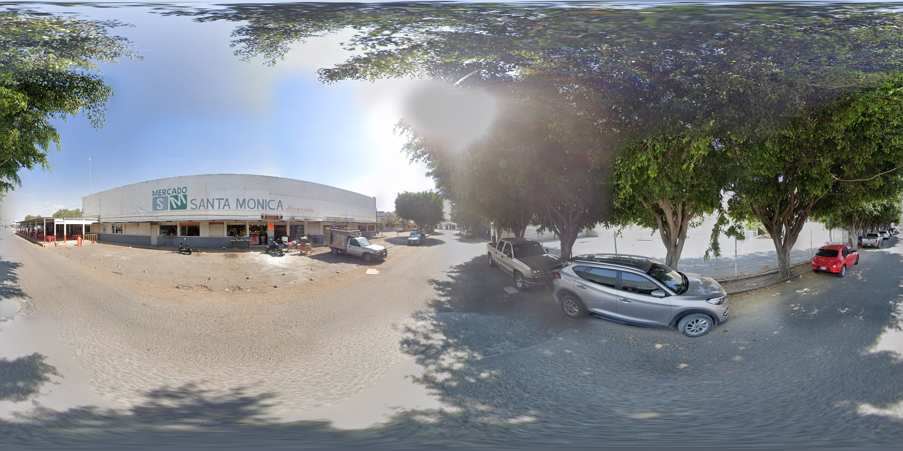
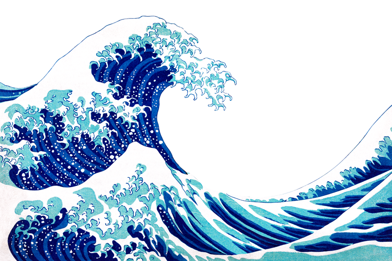
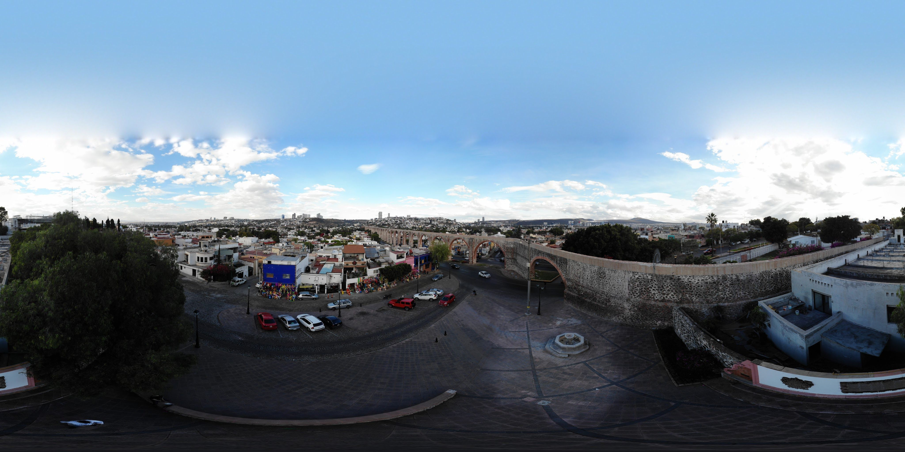
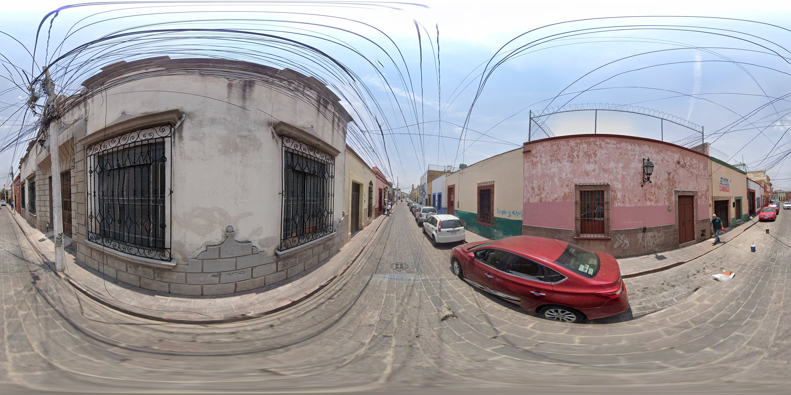
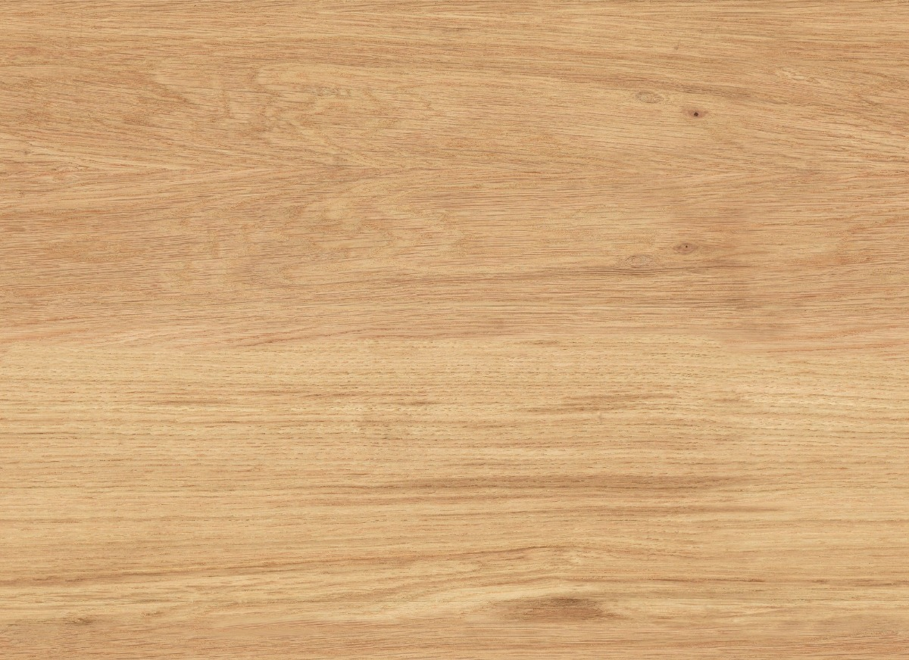

# Tutorial: A-Frame VR 360

<!--##**Live demo (optional):** https://YOUR-USERNAME.github.io/YOUR-REPO/-->
**Example https://vicvalens.github.io/vr_aframe/

## Index
- [Requirements](#requirements)
- [Project Structure](#project-structure)
- [Step 1: Basic Scene](#step-1-basic-scene)
- [Step 2: Run Locally](#step-2-run-locally-optional)
- [Step 3: 3D Model and 360 Environment](#step-3-3d-model-and-360-environment)
- [Step 4: Interaction (mouse/gaze) and image toggle](#step-4-interaction-mousegaze-and-image-toggle)
- [Step 5: Simple Teleport](#step-5-simple-teleport)
- [Step 6: Animation and Audio](#step-6-animation-and-audio)
- [Step 7: Video and Poster](#step-7-video-and-poster)
- [Step 8: Panoramara Cycle](#step-8-360-panorama-cycle)
- [Step 9: Materials](#step-9-materials)
- [Step 10: Shadows and Post-processing](#step-10-shadows-and-post-processing)
- [Step 11: Hybrid Controls (PC + VR)](#step-11-hybrid-controls-pc--vr)
- [Step 12: Publish on GitHub Pages](#step-12-publish-on-github-pages)
- [Credits](#credits)

---

## Requirements
- Browser compatible with **WebGL/WebXR** (Chrome, Edge, Firefox; optional VR headset).
- **Equirectangular 360 images (2:1)**.
- **Python** (or any simple static server) to serve local files.

## Project Structure
```
vr-aframe-tutorial/
├─ index.html
├─ image1.jpg
├─ image1.png
├─ 360image01.jpg
├─ 360image02.jpg
├─ 360image03.jpg
├─ 3Dmodel.glb
├─ sound.mp3
├─ video.mp4
```

---

## Step 1: Basic Scene
```
<!DOCTYPE html>
<html>
<head>
  <meta charset="utf-8">
  <title>Step 1</title>
  <script src="https://aframe.io/releases/1.5.0/aframe.min.js"></script>
</head>
<body>
  <a-scene>
    <a-box position="0 1 -3" rotation="0 45 0" color="#4CC3D9"></a-box>
    <a-plane rotation="-90 0 0" width="10" height="10" color="#7BC8A4"></a-plane>
    <a-sky color="#ECECEC"></a-sky>
  </a-scene>
</body>
</html>
```
Notes:
```
Useful primitives: `<a-box>`, `<a-sphere>`, `<a-cylinder>`, `<a-cone>`, `<a-plane>`, `<a-ring>`, `<a-torus>`, `<a-entity>`polyhedra are not native tags; use `geometry="primitive: dodecahedron"` on `<a-entity>` if needed.

Use HEX colors: https://www.color-hex.com/color-wheel/
```
---

## Step 2: Run Locally (Optional)

Server:
```
PC:
python -m http.server 8000

Mac:
python3 -m http.server 8000
```

Browser:
```
http://localhost:8000
```

---

## Step 3: 3D Model and 360 Environment

Model (inside `<a-scene>` using `<a-assets>`):
```
<a-assets>
  <a-asset-item id="model" src="3Dmodel.glb"></a-asset-item>
</a-assets>

<a-entity gltf-model="#model" position="0 0 -3" scale="1 1 1"></a-entity>
```

360 image (2:1):
```
<a-sky src="assets/360image01.jpg" rotation="0 -90 0"></a-sky>
```
Example:
```
<!DOCTYPE html>
<html>
<head>
  <meta charset="utf-8">
  <title>Step 3</title>
  <script src="https://aframe.io/releases/1.5.0/aframe.min.js"></script>
  <style>body{margin:0}</style>
</head>
<body>
  <a-scene>
    <a-assets>
      <a-asset-item id="model" src="3Dmodel.glb"></a-asset-item>
      
    </a-assets>

    <!-- 3D Model -->
    <a-entity gltf-model="#model" position="0 1.2 -2" scale="1 1 1"></a-entity>

    <!-- 360 Environment -->
    <a-sky src="#pano" rotation="0 -90 0"></a-sky>
  </a-scene>
</body>
</html>
```
Notes:
```
-For a Hard Reload (bypass cache) ⌘ + Shift + R (for mac) Ctrl + F5 or Shift + F5 or Ctrl + Shift + R (for Windows)

-GLB converter: https://imagetostl.com/convert/file/fbx/to/glb

-Install Street View Download 360 for Google Maps 360 images: https://svd360.com/
```
---

## Step 4: Interaction (mouse/gaze) and image toggle

Mouse raycast cursor:
```
<a-entity cursor="rayOrigin: mouse" raycaster="objects: .interactable"></a-entity>
```

Show/Hide image on click:
```
<a-box position="-4 1.5 -3" color="#FFFFFF" depth="0.2" height="1" width="1.5"
       class="interactable"
       onclick="const img=document.getElementById('revealed-image');img.setAttribute('visible', img.getAttribute('visible')==='false')">
</a-box>

<a-image id="revealed-image" src="image1.jpg"
         position="-4 2.5 -3" width="3" height="2" visible="false"></a-image>
```

Random color on click:
```
<a-box class="interactable" position="3 1 -3" color="#4CC3D9"
       onclick="this.setAttribute('color','#'+Math.floor(Math.random()*16777215).toString(16).padStart(6,'0'))">
</a-box>
```
Example:
```
<!DOCTYPE html>
<html>
<head>
  <meta charset="utf-8">
  <title>Step 4</title>
  <script src="https://aframe.io/releases/1.5.0/aframe.min.js"></script>
  <style>body{margin:0}</style>
</head>
<body>
  <a-scene>
    <!-- Background color -->
    <a-sky color="#BBDFFF"></a-sky>

    <!-- Assets -->
    <a-assets>
      
    </a-assets>

    <!-- Camera -->
    <a-entity camera look-controls position="0 1.6 0"></a-entity>

    <!-- Raycast .interactable -->
    <a-entity cursor="rayOrigin: mouse" raycaster="objects: .interactable"></a-entity>

    <!-- TOGGLE button (boolean) -->
    <a-box position="-0.8 1.25 -3" width="1.2" height="0.8" depth="0.2"
           color="#FFFFFF"
           class="interactable"
           onclick="
             const img = document.getElementById('revealed-image');
             img.setAttribute('visible', !img.getAttribute('visible'));
           ">
    </a-box>

    <!-- Image to show/hide -->
    <a-image id="revealed-image" src="#img1"
             position="0 2 -3" width="2" height="1.2" visible="false">
    </a-image>

    <!-- Random color -->
    <a-box position="0.8 1.25 -3" width="1" height="1" depth="1"
           color="#4CC3D9"
           class="interactable"
           onclick="this.setAttribute('color', '#'+Math.floor(Math.random()*16777215).toString(16).padStart(6,'0'))">
    </a-box>
  </a-scene>
</body>
</html>
```

---

## Step 5: Simple Teleport

Component:
```
<script>
AFRAME.registerComponent('teleport-on-click', {
  init: function () {
    this.el.addEventListener('click', () => {
      const rig = document.querySelector('#rig');
      const p = document.querySelector('#teleport-point').object3D.position;
      if (rig) rig.object3D.position.copy(p);
    });
  }
});
</script>
```

Usage in the scene:
```
<a-entity id="rig" position="0 1.6 0">
  <a-entity camera look-controls></a-entity>
</a-entity>

<a-box class="interactable" position="-3 1 -3" color="#FFC107" teleport-on-click></a-box>
<a-entity id="teleport-point" position="5 1.6 0"></a-entity>
```
Example:
```
<!DOCTYPE html>
<html>
<head>
  <meta charset="utf-8">
  <title>Step 5</title>
  <script src="https://aframe.io/releases/1.5.0/aframe.min.js"></script>
  <style>body{margin:0}</style>
</head>
<body>
  <a-scene>
    <!-- Background color -->
    <a-sky color="#BBDFFF"></a-sky>

    <!-- Start point -->
    <a-entity id="start-point" position="0 1.6 0"></a-entity>

    <!-- RIG: (WASD/keyboard arrows) -->
    <a-entity id="rig" wasd-controls position="0 1.6 0">
      <a-entity camera look-controls></a-entity>
    </a-entity>

    <!-- Cursor -->
    <a-entity cursor="rayOrigin: mouse" raycaster="objects: .interactable"></a-entity>

    <!-- Teletransport object -->
    <a-box class="interactable"
           position="0 1 -2" width="0.6" height="0.6" depth="0.6"
           color="#FFC107" teleport-on-click></a-box>
  </a-scene>

  <script>
    // Center ojects at start
    document.querySelector('a-scene').addEventListener('loaded', () => {
      const rig = document.getElementById('rig');
      const p   = document.getElementById('start-point').object3D.position;
      rig.object3D.position.copy(p);
    });

    // Teletransport position on click
    AFRAME.registerComponent('teleport-on-click', {
      init: function () {
        this.el.addEventListener('click', () => {
          const rig = document.getElementById('rig');
          const p   = document.getElementById('start-point').object3D.position;
          rig.object3D.position.copy(p);
        });
      }
    });
  </script>
</body>
</html>
```

---

## Step 6: Animation and Audio
```
<!-- Animation -->
<a-box position="0 2 -5" rotation="0 45 45" scale="2 2 2"
       animation="property: object3D.position.y; to: 2.2; dir: alternate; dur: 2000; loop: true"></a-box>

<!-- On-demand audio -->
<a-sphere class="interactable" position="4 1.5 -3" radius="0.5" color="#3399FF"
          onclick="document.querySelector('#audio').components.sound.playSound()"></a-sphere>
<a-sound id="audio" src="sound.mp3" autoplay="false"></a-sound>
```
Example:
```
<!DOCTYPE html>
<html>
<head>
  <meta charset="utf-8">
  <title>Step 6</title>
  <script src="https://aframe.io/releases/1.5.0/aframe.min.js"></script>
  <style>body{margin:0}</style>
</head>
<body>
  <a-scene>
    <!-- Solid background -->
    <a-sky color="#BBDFFF"></a-sky>

    <!-- Light so the GLB is visible (PBR) -->
    <a-entity light="type: hemisphere; intensity: 1; groundColor: #666" position="0 4 0"></a-entity>

    <!-- Rig: look with mouse, move with keyboard -->
    <a-entity id="rig" wasd-controls position="0 1.6 0">
      <a-entity camera look-controls></a-entity>
    </a-entity>

    <!-- Mouse cursor to click the audio trigger -->
    <a-entity cursor="rayOrigin: mouse" raycaster="objects: .interactable"></a-entity>

    <!-- Assets: GLB model + MP3 -->
    <a-assets>
      <a-asset-item id="model" src="flecha.glb"></a-asset-item>
      <audio id="mp3" src="sound.mp3" preload="auto"></audio>
    </a-assets>

    <!-- (1) Floating 3D model -->
    <a-entity gltf-model="#model"
              position="0 1.4 -3" scale="1 1 1" rotation="0 20 0"
              animation="property: object3D.position.y; to: 1.7; dir: alternate; dur: 1500; loop: true">
    </a-entity>

    <!-- (2) Clickable sphere that plays an MP3 -->
    <a-sphere class="interactable" position="1.5 1.25 -2.5" radius="0.4" color="#3399FF"
              onclick="document.querySelector('#hit-sound').components.sound.playSound()">
    </a-sphere>
    <a-sound id="hit-sound" src="#mp3" autoplay="false"></a-sound>
  </a-scene>
</body>
</html>
```
---
## Step 7: Video and Poster
Example:
```
<!DOCTYPE html>
<html>
<head>
  <meta charset="utf-8">
  <title>Step 7</title>
  <script src="https://aframe.io/releases/1.5.0/aframe.min.js"></script>
  <style>body{margin:0}</style>
</head>
<body>
  <a-scene>
    <!-- Background color -->
    <a-sky color="#BBDFFF"></a-sky>

    <!-- Movement: look with mouse, move with keyboard -->
    <a-entity id="rig" wasd-controls position="0 1.6 0">
      <a-entity camera look-controls></a-entity>
    </a-entity>

    <!-- Mouse cursor to click the video plane -->
    <a-entity cursor="rayOrigin: mouse" raycaster="objects: .interactable"></a-entity>

    <!-- Assets: MP4 video + poster image -->
    <a-assets>
      <video id="clip" src="video.mp4" playsinline webkit-playsinline loop></video>
      anonymous"></video>
      
    </a-assets>

    <!-- Video screen (click to play/pause) -->
    <a-video class="interactable"
             src="#clip"
             position="0 1.5 -3"
             width="3.2" height="1.8"
             onclick="
               const v=document.getElementById('clip');
               if(v.paused){ v.play(); } else { v.pause(); }
             ">
    </a-video>

    <!-- Poster -->
    <a-image src="#poster"
             position="2 1.6 -2"
             width="1.2" height="1.8"
             rotation="0 -90 0">
    </a-image>
  </a-scene>
</body>
</html>
```
## Step 8: 360 Panorama cycle
Example:
```
<!DOCTYPE html>
<html>
<head>
  <meta charset="utf-8">
  <title>Step 8</title>
  <script src="https://aframe.io/releases/1.5.0/aframe.min.js"></script>
  <style>body{margin:0}</style>
</head>
<body>
  <a-scene>
    <!-- Preload three 360 images -->
    <a-assets>
      
      
      
    </a-assets>

    <!-- Camera: look around with mouse -->
    <a-entity camera look-controls position="0 1.6 0"></a-entity>

    <!-- Mouse cursor to click the sphere -->
    <a-entity cursor="rayOrigin: mouse" raycaster="objects: .interactable"></a-entity>

    <!-- 360 background -->
    <a-sky id="sky" src="#p1"></a-sky>

    <!-- Sphere that changes the 360 background and moves each click -->
    <a-sphere id="cycler" class="interactable" radius="0.25" color="#FF7F50"></a-sphere>
  </a-scene>

  <script>
    // Minimal cycler: click the sphere -> change sky image and move sphere
    AFRAME.registerComponent('cycle-panos', {
      init: function () {
        this.idx = 0;
        this.panos = ['#p1', '#p2', '#p3'];
        this.positions = [
          new THREE.Vector3(0, 1.25, -2),
          new THREE.Vector3(-1.2, 1.3, -2.2),
          new THREE.Vector3(1.4, 1.2, -1.8)
        ];
        // place sphere for the initial 360 image
        this.el.object3D.position.copy(this.positions[this.idx]);

        this.el.addEventListener('click', () => {
          this.idx = (this.idx + 1) % this.panos.length;
          document.getElementById('sky').setAttribute('src', this.panos[this.idx]);
          this.el.object3D.position.copy(this.positions[this.idx]);
        });
      }
    });

    // Attach the component to the sphere
    document.getElementById('cycler').setAttribute('cycle-panos', '');
  </script>
</body>
</html>
```


## Step 9: Materials
Example:
```
<!DOCTYPE html>
<html>
<head>
  <meta charset="utf-8">
  <title>Step 9</title>
  <script src="https://aframe.io/releases/1.5.0/aframe.min.js"></script>
  <style>body{margin:0}</style>
</head>
<body>
  <!-- Renderer: physically-correct, ACES tone mapping, antialias -->
  <a-scene renderer="physicallyCorrectLights: true; colorManagement: true; toneMapping: ACESFilmicToneMapping; antialias: true">
    <a-assets>
      <!-- 360 pano used for background + reflections -->
      
      <!-- texture for the cylinder -->
      
    </a-assets>

    <!-- 360 background -->
    <a-sky id="sky" src="#pano"></a-sky>

    <!-- Soft “ambient” and a key light for crisp highlights -->
    <a-entity light="type: hemisphere; intensity: 1; groundColor: #666" position="0 4 0"></a-entity>
    <a-entity light="type: directional; intensity: 1.2" position="2 4 2"></a-entity>

    <!-- Camera/controls -->
    <a-entity id="rig" wasd-controls position="0 1.6 0">
      <a-entity camera look-controls></a-entity>
    </a-entity>

    <!-- Metal sphere (mirror-like) -->
    <a-sphere position="-1.8 1 -3" radius="0.5"
              material="metalness: 1; roughness: 0.05; color: #888">
    </a-sphere>

    <!-- Glass cube (transparent) -->
    <a-box position="0 1 -3" depth="1" height="1" width="1"
           material="color: #aaf; opacity: 0.25; transparent: true; metalness: 0.5; roughness: 0.05">
    </a-box>

    <!-- Shiny plastic cone -->
    <a-cone position="1.8 1 -3" height="1.2" radius-bottom="0.6"
            material="color: #ff00ff; metalness: 0.5; roughness: 0.25">
    </a-cone>

    <!-- Cylinder with image texture -->
    <a-cylinder position="0 0.75 -1.5" radius="0.4" height="1.5"
                material="src: #tex1; roughness: 0.4; metalness: 0.1">
    </a-cylinder>
  </a-scene>

  <script>
    // Use the pano as the environment map (reflections) via PMREM
    const sceneEl = document.querySelector('a-scene');
    sceneEl.addEventListener('loaded', () => {
      const renderer = sceneEl.renderer;
      if (!renderer) return;

      const pmrem = new THREE.PMREMGenerator(renderer);
      new THREE.TextureLoader().load(
        document.getElementById('pano').getAttribute('src'),
        (tex) => {
          tex.mapping = THREE.EquirectangularReflectionMapping;
          // Prefilter for PBR (smoother, realistic reflections)
          const envMap = pmrem.fromEquirectangular(tex).texture;
          sceneEl.object3D.background = tex;     // keep pano as background
          sceneEl.object3D.environment = envMap; // reflections for PBR
        }
      );
    });
  </script>
</body>
</html>
```

---

## Step 10: Shadows and Post-processing
Example:
```
<!DOCTYPE html>
<html>
<head>
  <meta charset="utf-8">
  <title>Step 10</title>
  <script src="https://aframe.io/releases/1.5.0/aframe.min.js"></script>
  <style>body{margin:0}</style>
</head>
<body>
  <a-scene
    renderer="physicallyCorrectLights: true; colorManagement: true; toneMapping: ACESFilmicToneMapping; antialias: true"
    shadow="type: pcfsoft">

    <!-- Assets -->
    <a-assets>
      <!-- Environment -->
      
      
    </a-assets>

    <!-- Visible 360 background -->
    <a-sky id="sky" src="#pano"></a-sky>

    <!-- Lights -->
    <a-entity id="sun"
      light="type: directional; intensity: 1.2; castShadow: true"
      position="3 6 3" rotation="-45 45 0">
    </a-entity>
    <a-entity light="type: ambient; intensity: 0.35"></a-entity>

    <!-- Camera / controls -->
    <a-entity id="rig" wasd-controls position="0 1.6 0">
      <a-entity camera look-controls></a-entity>
    </a-entity>

    <!-- Transparent ground that only shows shadows -->
    <a-plane rotation="-90 0 0" position="0 0 -3" width="12" height="12"
             shadow="receive: true" shadow-receiver="opacity: 0.28">
    </a-plane>

    <!-- Objects (cast shadows) -->
    <!-- Metal sphere (strong reflections) -->
    <a-sphere position="-1.8 1 -3" radius="0.5"
              material="metalness: 1; roughness: 0.05; color: #888"
              shadow="cast: true"></a-sphere>

    <!-- Glassy cube (semi-transparent, reflective) -->
    <a-box position="0 1 -3" depth="1" height="1" width="1"
           material="color: #aaf; opacity: 0.3; transparent: true; metalness: 0.5; roughness: 0.05"
           shadow="cast: true"></a-box>

    <!-- Shiny plastic cone -->
    <a-cone position="1.8 1 -3" height="1.2" radius-bottom="0.6"
            material="color: #ff00ff; metalness: 0; roughness: 0.25"
            shadow="cast: true"></a-cone>

    <!-- Cylinder with texture -->
    <a-cylinder position="0 0.75 -1.5" radius="0.4" height="1.5"
                material="src: #tex1; roughness: 0.4; metalness: 0.05"
                shadow="cast: true"></a-cylinder>
  </a-scene>

  <script>
    // 1) Transparent shadow ground (THREE.ShadowMaterial)
    AFRAME.registerComponent('shadow-receiver', {
      schema: { opacity: { default: 0.28 } },
      init() {
        this.apply = this.apply.bind(this);
        this.el.addEventListener('object3dset', this.apply);
        this.apply();
      },
      remove() { this.el.removeEventListener('object3dset', this.apply); },
      apply() {
        const mesh = this.el.getObject3D('mesh');
        if (!mesh) return;
        mesh.traverse(o => {
          if (o.isMesh) {
            o.material = new THREE.ShadowMaterial({ opacity: this.data.opacity });
            o.material.depthWrite = false;
            o.receiveShadow = true;
          }
        });
      }
    });
    document.querySelector('a-plane').setAttribute('shadow-receiver', 'opacity: 0.28');

    // 2) Soften shadows
    const sceneEl = document.querySelector('a-scene');
    sceneEl.addEventListener('loaded', () => {
      const sun = document.getElementById('sun').getObject3D('light');
      if (sun && sun.shadow) {
        sun.shadow.mapSize.set(1024, 1024);
        sun.shadow.radius = 4;
        sun.shadow.bias = -0.0001;
        sun.shadow.normalBias = 0.02;
        const cam = sun.shadow.camera;
        cam.near = 0.5; cam.far = 50;
        cam.left = -12; cam.right = 12; cam.top = 12; cam.bottom = -12;
        cam.updateProjectionMatrix();
      }

      // 3) ***ENVIRONMENT REFLECTIONS*** from the 360 pano (PMREM)
      const renderer = sceneEl.renderer;
      if (!renderer) return;

      const pmrem = new THREE.PMREMGenerator(renderer);
      const panoSrc = document.getElementById('pano').getAttribute('src');

      new THREE.TextureLoader().load(
        panoSrc,
        (tex) => {
          // If your pano is sRGB, set color space (A-Frame/three r150+)
          if (THREE.SRGBColorSpace) tex.colorSpace = THREE.SRGBColorSpace;
          // Use as visible background:
          tex.mapping = THREE.EquirectangularReflectionMapping;
          sceneEl.object3D.background = tex;

          // Build prefiltered env map for PBR reflections:
          const envRT = pmrem.fromEquirectangular(tex);
          sceneEl.object3D.environment = envRT.texture;
        },
        undefined,
        (err) => console.warn('Failed to load pano for env map:', err)
      );
    });
  </script>
</body>
</html>
```

---

## Step 11: Hybrid Controls (PC + VR)
```
<!-- Extras: movement-controls (gamepad/keyboard) -->
<script src="https://cdn.jsdelivr.net/gh/donmccurdy/aframe-extras@latest/dist/aframe-extras.min.js"></script>

<a-entity id="rig" movement-controls="controls: gamepad,keyboard; speed: 0.2" position="0 1.6 0">
  <a-entity id="camera" camera look-controls></a-entity>
  <a-entity laser-controls="hand: left"  raycaster="objects: .interactable"></a-entity>
  <a-entity laser-controls="hand: right" raycaster="objects: .interactable"></a-entity>
</a-entity>
```

*iOS (Safari) tip:* for gyroscope control, add a button that requests permission via `DeviceMotionEvent.requestPermission()`.

---

## Step 12: Publish on GitHub Pages

Make sure you have `index.html` at the **root** (or inside `/docs`).

In your repository:
```
Settings → Pages
```

Source:
```
Deploy from a branch → main → /(root) or /docs → Save
```

Your URL will be:
```
https://YOUR-USERNAME.github.io/YOUR-REPO/
```

---

## Credits
- Author: **VV**
- Framework: https://aframe.io
